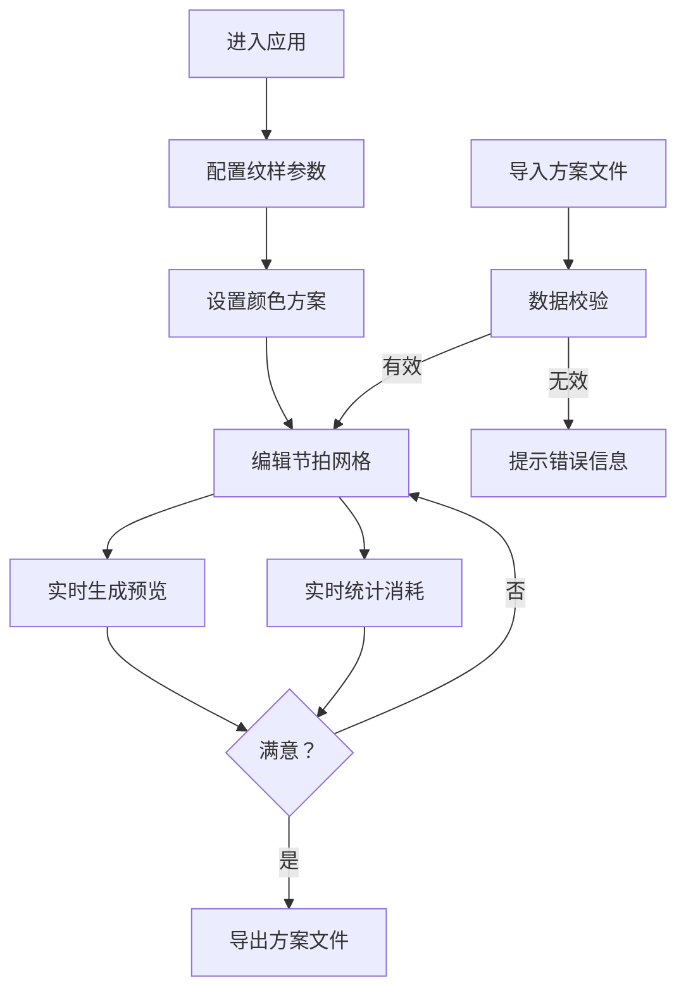

## 1. 产品概述

织带纹样节拍设计工具是一款面向手工织带工作室的专业设计软件，帮助工匠可视化设计经纬纹样的节拍图案，并精准预估不同颜色线材的消耗量。通过直观的网格编辑器和实时预览功能，大幅提升纹样设计效率。

- 核心价值：将传统手工织带的纹样设计数字化，实现可视化编辑与精准用料估算
- 目标用户：手工织带工作室设计师、手工艺爱好者、织带教学从业者

## 2. 核心功能

### 2.1 用户角色

| 角色 | 注册方式 | 核心权限 |
|------|----------|----------|
| 设计师 | 无需注册 | 创建、编辑、导入导出纹样方案，预览效果，查看线材消耗统计 |

### 2.2 功能模块

1. **节拍网格编辑器**：核心交互区域，支持点选上色、清除、批量操作
2. **纹样参数设置**：经线数量、纬线循环周期、颜色方案配置
3. **实时纹样预览**：根据节拍网格实时渲染完整纹样效果
4. **线材消耗统计**：ECharts 饼图/柱状图展示各颜色使用次数与比例
5. **方案导入导出**：JSON 格式方案文件的导入导出与数据校验

### 2.3 页面详情

| 页面名称 | 模块名称 | 功能描述 |
|----------|----------|----------|
| 主设计页 | 顶部标题栏 | 应用名称、快捷操作按钮（新建、导入、导出） |
| 主设计页 | 左侧设置面板 | 经线数量设置、纬线循环周期设置、颜色方案管理 |
| 主设计页 | 中央编辑区 | 节拍网格编辑器、选色工具 |
| 主设计页 | 右侧预览区 | 纹样实时预览图、线材消耗统计图表 |

## 3. 核心流程

### 3.1 设计流程

用户进入应用后，首先配置基础参数（经线数量、循环周期、颜色方案），然后在节拍网格中逐一点选或绘制纹样图案，系统实时计算并展示纹样预览效果和线材消耗数据。设计完成后可导出方案文件，或导入已有方案进行修改。

### 3.2 流程图

## 4. 用户界面设计

### 4.1 设计风格

- **整体调性**：温暖手工艺风，融合现代简洁交互，体现织带工艺的精致感与温度
- **主色调**：暖米色背景（#FAF7F2），搭配深棕色文字（#3D2C1E），营造手工工作室氛围
- **强调色**：朱砂红（#C84B31）作为主要交互强调色，象征织线的热情
- **辅助色**：一系列丰富的纱线色卡，支持自定义
- **字体**：标题使用具有人文气息的衬线字体，正文使用清晰易读的无衬线字体
- **按钮风格**：微圆角、轻阴影，悬浮时有细腻的颜色过渡
- **布局风格**：三栏式布局（设置面板 | 编辑区 | 预览统计），卡片式容器
- **质感细节**： subtle 的织物纹理背景、纱线质感的颜色块、针脚式分隔线

### 4.2 页面设计概览

| 页面名称 | 模块名称 | UI 元素 |
|----------|----------|---------|
| 主设计页 | 顶部标题栏 | Logo、应用名称、新建/导入/导出按钮、纱线色卡装饰条 |
| 主设计页 | 设置面板 | 参数输入框（带步进器）、颜色列表（支持增删改）、折叠式分组 |
| 主设计页 | 网格编辑器 | 可交互网格、当前颜色指示器、网格缩放控制、清空/填充工具 |
| 主设计页 | 预览区 | 纹样预览画布（可滚动）、消耗统计切换（饼图/柱状图）、数据明细 |
| 主设计页 | 导入弹窗 | 文件上传区域、校验结果展示、确认/取消按钮 |

### 4.3 响应式

- 采用桌面端优先设计，主适用场景为 1280px 及以上宽度
- 中等屏幕（1024-1279px）保持三栏布局，适当压缩间距
- 小屏幕（<1024px）自动切换为上下布局，设置面板和预览区可折叠

### 4.4 动效设计

- 网格点选时有轻微的缩放弹跳动效
- 颜色切换时有平滑的过渡动画
- 预览图更新时有淡入淡出效果
- 数据统计变化时有数值滚动动画
- 面板展开折叠有流畅的高度过渡
