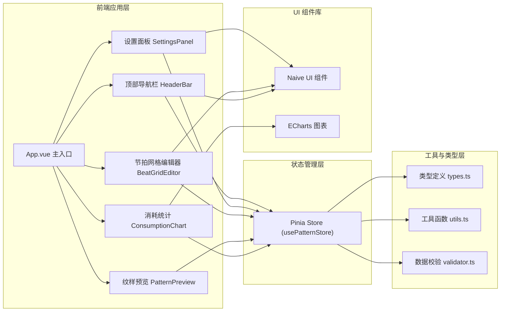

## 1. 架构设计



## 2. 技术选型说明

- **前端框架**：Vue 3.4 + TypeScript 5.3 + Vite 5.1
- **状态管理**：Pinia 2.1
- **UI 组件库**：Naive UI 2.38
- **图表库**：ECharts 5.5 + vue-echarts 6.6
- **构建工具**：Vite 5.1
- **样式方案**：SCSS + CSS Variables
- **图标**：xicons（Naive UI 配套图标库）

## 3. 目录结构

```
src/
├── components/
│   ├── HeaderBar.vue          # 顶部导航栏
│   ├── SettingsPanel.vue      # 左侧设置面板
│   ├── BeatGridEditor.vue     # 节拍网格编辑器（核心）
│   ├── ColorPicker.vue        # 颜色选择器组件
│   ├── PatternPreview.vue     # 纹样预览组件
│   └── ConsumptionChart.vue   # 线材消耗统计图表
├── stores/
│   └── pattern.ts             # Pinia 纹样状态管理
├── types/
│   └── index.ts               # TypeScript 类型定义
├── utils/
│   ├── pattern.ts             # 纹样相关工具函数
│   └── validator.ts           # 数据校验函数
├── styles/
│   ├── variables.scss         # 全局 CSS 变量
│   └── global.scss            # 全局样式
├── App.vue                    # 根组件
└── main.ts                    # 应用入口
```

## 4. 数据模型定义

### 4.1 核心类型

```typescript
// 颜色项
interface ColorItem {
  id: string;       // 颜色唯一标识
  name: string;     // 颜色名称
  value: string;    // 颜色值（HEX）
}

// 纹样节拍数据
// 二维数组：grid[纬线行索引][经线列索引] = 颜色ID 或 null（空格）
type BeatGrid = (string | null)[][];

// 纹样方案
interface PatternSchema {
  version: string;           // 方案版本号
  name: string;              // 方案名称
  warpCount: number;         // 经线数量
  weftCycle: number;         // 纬线循环周期
  colors: ColorItem[];       // 颜色方案列表
  grid: BeatGrid;            // 节拍网格数据
  createdAt: string;         // 创建时间
  updatedAt: string;         // 更新时间
}

// 消耗统计项
interface ConsumptionItem {
  colorId: string;
  colorName: string;
  colorValue: string;
  count: number;             // 使用次数
  percentage: number;        // 占比（0-1）
}
```

### 4.2 Pinia Store 状态

```typescript
interface PatternState {
  warpCount: number;          // 经线数量
  weftCycle: number;          // 纬线循环周期
  colors: ColorItem[];        // 颜色列表
  grid: BeatGrid;             // 节拍网格
  currentColorId: string;     // 当前选中的颜色ID
  previewRepeat: number;      // 预览重复次数
}
```

## 5. Store Actions

| Action 名称 | 参数 | 功能描述 |
|-------------|------|----------|
| setWarpCount | count: number | 设置经线数量，重建网格 |
| setWeftCycle | cycle: number | 设置纬线循环周期，重建网格 |
| addColor | color: ColorItem | 添加新颜色 |
| removeColor | colorId: string | 删除颜色（保留至少2种） |
| updateColor | colorId: string, data: Partial<ColorItem> | 更新颜色信息 |
| setCurrentColor | colorId: string | 设置当前绘图颜色 |
| setCell | row: number, col: number, colorId: string \| null | 设置单个格子颜色 |
| clearGrid | - | 清空整个网格 |
| fillGrid | colorId: string | 用指定颜色填充整个网格 |
| exportSchema | - | 导出纹样方案 JSON |
| importSchema | schema: PatternSchema | 导入并校验纹样方案 |
| getConsumptionStats | - | 计算线材消耗统计数据 |
| resizeGrid | - | 根据当前参数重建网格 |

## 6. 数据校验规则

导入方案时需要校验以下内容：

| 校验项 | 规则 | 错误提示 |
|--------|------|----------|
| 经线数量 warpCount | 必须为正整数，建议范围 1-200 | 经线数量无效，必须为大于 0 的整数 |
| 纬线周期 weftCycle | 必须为正整数，建议范围 1-100 | 纬线循环周期无效，必须为大于 0 的整数 |
| 颜色数量 | 至少 2 种颜色 | 颜色方案至少需要 2 种颜色 |
| 颜色 ID 唯一性 | colors 中所有 id 必须唯一 | 存在重复的颜色编号 |
| 颜色值格式 | 必须为有效的 HEX 颜色值 | 存在无效的颜色值 |
| 网格行数 | grid.length 必须等于 weftCycle | 网格行数与纬线周期不匹配 |
| 网格列数 | 每行长度必须等于 warpCount | 网格列数与经线数量不匹配 |
| 网格数据 | 每个单元格必须为 null 或 colors 中存在的 colorId | 网格中存在无效的颜色编号 |

## 7. 性能考量

- 网格渲染采用 CSS Grid + 虚拟滚动（当网格较大时）
- 预览图使用 Canvas 渲染以保证性能
- 消耗统计使用计算属性缓存，数据变更时才重新计算
- 防抖处理输入框变更，避免频繁重渲染
- ECharts 图表开启懒更新和动画优化
